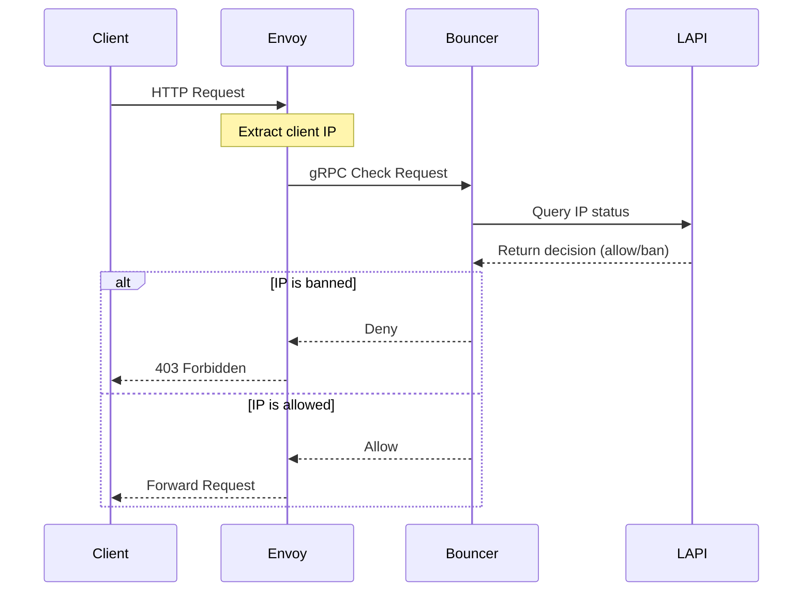

+++
author = "Kyle Wilson"
title = "Writing a CrowdSec Envoy Proxy Bouncer"
date = "2023-02-23"
description = "Building a CrowdSec Bouncer for Envoy Proxy to protect Kubernetes services in my homelab"
summary = "A detailed walkthrough of implementing a CrowdSec bouncer for Envoy porxy, including code examples and deployment configuration."
tags = [
    "kubernetes",
    "crowdsec",
    "envoy-proxy",
    "envoy-gateway",
    "homelab",
    "golang",
    "go"
]
+++

# Tl;DR
For those that want to skip the reading and deploy the bouncer, here is the [source code](https://github.com/kdwils/envoy-proxy-crowdsec-bouncer). It is still a work in progress, but it is functional. Use it at your own risk.

It takes advantage of [crowdsec's bouncer pkg](https://github.com/crowdsecurity/go-cs-bouncer) and envoy proxy's [control plane pkg](https://github.com/envoyproxy/go-control-plane) to create a simple envoy proxy bouncer.

The bouncer works as an ext authz filter for envoy-gateway. I apply a security policy to the gateway to point it to the bouncer for all requests.


```yaml
apiVersion: gateway.envoyproxy.io/v1alpha1
kind: SecurityPolicy
metadata:
  name: envoy-bouncer-policy
  namespace: envoy-gateway-system
spec:
  targetRef:
    group: gateway.networking.k8s.io
    kind: Gateway
    name: homelab
  extAuth:
    grpc:
      backendRefs:
        - group: ""
          kind: Service
          name: envoy-bouncer
          port: 8080
          namespace: envoy-gateway-system
```


My deployment manifest lives [here](https://github.com/kdwils/homelab/tree/main/monitoring/envoy-gateway-bouncer) if you need a reference.

I'll probably get a more detailed writeup on deploying it in the future, but for now this should be enough to get you started.

Some metrics from the envoy bouncer deployed in my cluster. Metrics are updated every 15 minutes.
```shell
╭───────────────────────────────────────────────────╮
│ Bouncer Metrics (envoy-bouncer) since 2025-05-30  │ 
│16:39:34 +0000                                     │
│ UTC                                               │
├────────┬─────────────────────────────────┬────────┤
│ Origin │             requests            │ unique │
│        │  bounced │  cached  │ processed │   ips  │
├────────┼──────────┼──────────┼───────────┼────────┤
│  Total │        2 │      197 │       233 │     26 │
╰────────┴──────────┴──────────┴───────────┴────────╯
````

> ⚠️ **Warning**  
> If you misconfigure this, you will likely lose connectivity through the Envoy Gateway. To recover:
> 1. Delete the SecurityPolicy
> 2. Restart the gateway pod if needed
> 3. Verify your configuration before reapplying

# What is crowdsec, and what does a bouncer do?

There are a few components that work together to make the solution work.

- LAPI (Local API) is a local API that allows you to interact with your local crowdsec instance
- [Log Parsers](https://docs.crowdsec.net/docs/parsers/intro/) parse logs and feeds them into scenarios
- Scenarios are a collection of [rules](https://docs.crowdsec.net/docs/scenarios/intro/) that are evaluated against the logs. A scenario that is triggered sends an alert to the LAPI.
- A decision is made on whether to ban or not ban an IP, for example
- A bouncer acts on a decision and decides what to do with a request.

A bouncer is required to take action against the request

Got all of that? (It took me days of troubleshooting to put it all together because i'm too stubborn to read documentation)
### The local api

[CrowdSec](https://www.crowdsec.net/) is a cloud-native security solution that aims to protect your infrastructure from bad actors or malicious attacks. 

The LAPI (Local API) is a local API that allows you to interact with your local api instance. This service serves the purpose of managing your bouncers, machines, and communicating with CrowdSec remotely.

I deployed the LAPI to my cluster using their helm charts. You can see my manifests [here](https://github.com/kdwils/homelab/tree/main/monitoring/crowdsec). The installation instructions can be found [here](https://app.crowdsec.net/security-engines/setup?distribution=kubernetes).

Basically, you deploy the LAPI with an enrollment key and the approve it on the dashboard afterwards.

After this is deployed and running you can interact with the LAPI using the cli on the pod.

To list your connected machines, you can run the following command. If you only have the LAPI installed you won't see anything listed here.
```shell
➜ k exec -it pods/crowdsec-lapi-6c6679c847-v2vbn -n crowdsec -- cscli machines list

───────────────────────────────────────────────────────────────────────────────────────────────────────────────────────────────────────────────────────────────
 Name                  IP Address   Last Update           Status  Version                              OS                            Auth Type  Last Heartbeat 
───────────────────────────────────────────────────────────────────────────────────────────────────────────────────────────────────────────────────────────────
 vps                   10.42.5.219  2025-05-30T15:50:30Z  ✔️      v1.6.8-rpm-pragmatic-arm64-f209766e  Oracle Linux Server/9.5       password   12s            
 crowdsec-agent-9sn7b  10.42.5.58   2025-05-30T15:50:00Z  ✔️      v1.6.8-f209766e-docker               Alpine Linux (docker)/3.21.3  password   42s            
 crowdsec-agent-z5k5s  10.42.4.130  2025-05-30T15:50:24Z  ✔️      v1.6.8-f209766e-docker               Alpine Linux (docker)/3.21.3  password   18s            
 crowdsec-agent-trc7g  10.42.3.23   2025-05-30T15:50:26Z  ✔️      v1.6.8-f209766e-docker               Alpine Linux (docker)/3.21.3  password   16s            
───────────────────────────────────────────────────────────────────────────────────────────────────────────────────────────────────────────────────────────────
```

### Adding a machine

The VPS listed here is an oracle cloud instance. I use it as an ingress point for exposing things like Plex. Because this machine is exposed to the public internet it is a good candidate for installing crowdsec.

Again, we can visit the installation page, but this time for [linux](https://app.crowdsec.net/security-engines/setup?distribution=linux). Once installed, enroll the machine

```shell
sudo cscli console enroll -e context <your-enrollment-key>
systemctl restart crowdsec.service
```

You should be able to see the machine in the list of machines.

The other agents listed here are from a daemonset running in my cluster.

## Bouncers

A bouncer is the component that will take action to block a request if the ip is detected as malicious. The LAPI is the source of truth for determining if an IP is malicious or not. A malicious IP will have a state of `ban`, for example.

For the VPS, I added crowdsec's official firewall bouncer for nftables
```shell
sudo apt install crowdsec-firewall-bouncer-nftables
```

From the pod cscli add the bouncer and grab the token output
```shell
crowdsec-lapi-6c6679c847-v2vbn:/# cscli bouncers add vps-firewall -f -
```

Then, on the vps we need to configure the bouncer to use the token we just got from the LAPI.
```shell
sudo nano /etc/crowdsec/bouncers/crowdsec-firewall-bouncer.yaml
```

Set the API key and the API url that points to your LAPI instance
```yaml
api_url: <your-lapi-url>
api_key: <your-api-key>
```

Finally, restart the service
```shell
sudo systemctl restart crowdsec-firewall-bouncer.service
```

You should be able to see the bouncer in the list of bouncers.

Some metrics from the bouncer from my setup
```shell
cscli metrics
╭───────────────────────────────────────────────────────────────────────────────────────────╮
│ Bouncer Metrics (vps-firewall) since 2025-05-28 16:08:13 +0000 UTC                        │
├────────────────────────────┬──────────────────┬───────────────────┬───────────────────────┤
│ Origin                     │ active_decisions │      dropped      │       processed       │
│                            │        IPs       │  bytes  │ packets │   bytes   │  packets  │
├────────────────────────────┼──────────────────┼─────────┼─────────┼───────────┼───────────┤
│ CAPI (community blocklist) │           23.71k │ 134.33k │   2.50k │         - │         - │
│ crowdsec (security engine) │                0 │  87.40k │   1.38k │         - │         - │
├────────────────────────────┼──────────────────┼─────────┼─────────┼───────────┼───────────┤
│                      Total │           23.71k │ 221.73k │   3.88k │     2.53G │     1.73M │
╰────────────────────────────┴──────────────────┴─────────┴─────────┴───────────┴───────────╯
```

# Writing a CrowdSec Envoy Proxy Bouncer

Here is the gameplan



Basically, our bouncer needs to know how to extract the actual client IP from the request, and then query the LAPI to see if the IP is banned or not. If it is, we need to deny the request. Otherwise, we allow it.

Envoy already has a [go control plane](https://github.com/envoyproxy/go-control-plane) written, we can reference it in our bouncer for the gRPC calls.

To start, we need to set up a gRPC server that will handle the requests from Envoy that implements the [envoy_authz.CheckRequest](https://github.com/envoyproxy/go-control-plane/tree/main/envoy/service/auth/v3) service.

Here is a graceful implementation of the server that I wrote for this project
```go
package server

import (
	"context"
	"fmt"
	"log/slog"
	"net"

	auth "github.com/envoyproxy/go-control-plane/envoy/service/auth/v3"
	envoy_type "github.com/envoyproxy/go-control-plane/envoy/type/v3"
	"github.com/kdwils/envoy-proxy-bouncer/bouncer"
	"github.com/kdwils/envoy-proxy-bouncer/config"
	"github.com/kdwils/envoy-proxy-bouncer/logger"
	"google.golang.org/genproto/googleapis/rpc/status"
	"google.golang.org/grpc"
	"google.golang.org/grpc/reflection"
)

type Server struct {
	auth.UnimplementedAuthorizationServer
	bouncer bouncer.Bouncer
	config  config.Config
	logger  *slog.Logger
}

func NewServer(config config.Config, bouncer bouncer.Bouncer, logger *slog.Logger) *Server {
	return &Server{
		config:  config,
		bouncer: bouncer,
		logger:  logger,
	}
}

func (s *Server) Serve(ctx context.Context, port int) error {
	lis, err := net.Listen("tcp", fmt.Sprintf(":%d", port))
	if err != nil {
		return fmt.Errorf("failed to listen: %v", err)
	}

	grpcServer := grpc.NewServer(
		grpc.UnaryInterceptor(s.loggerInterceptor),
	)
	auth.RegisterAuthorizationServer(grpcServer, s)
	reflection.Register(grpcServer)

	go func() {
		<-ctx.Done()
		s.logger.Info("shutting down gRPC server...")
		grpcServer.GracefulStop()
		s.logger.Info("gRPC server shutdown complete")
	}()

	return grpcServer.Serve(lis)
}
```

Next the server needs to implement the `CheckRequest` method

```go
func (s *Server) Check(ctx context.Context, req *auth.CheckRequest) (*auth.CheckResponse, error) {
  return nil, nil
}
```

The request struct looks like this
```
type CheckRequest struct {
    state         protoimpl.MessageState
    sizeCache     protoimpl.SizeCache
    unknownFields protoimpl.UnknownFields

    // The request attributes.
    Attributes *AttributeContext `protobuf:"bytes,1,opt,name=attributes,proto3" json:"attributes,omitempty"`
}
```

We can extract the socket ip and the request headers from the request attributes
```go
	ip := ""
	if req.Attributes != nil && req.Attributes.Source != nil && req.Attributes.Source.Address != nil {
		if socketAddress := req.Attributes.Source.Address.GetSocketAddress(); socketAddress != nil {
			ip = socketAddress.GetAddress()
		}
	}

	headers := make(map[string]string)
	if req.Attributes != nil && req.Attributes.Request != nil && req.Attributes.Request.Http != nil {
		headers = req.Attributes.Request.Http.Headers
	}
```

This should be sufficient enough to get us started to determine who is making the request. We will be making use for the x-forwarded-for header to determine the client IP if we can.

Next, we need to implement the logic to determine if the IP is banned or not. This is where the LAPI comes in.

I house the requirements for this in a bouncer struct
```go
type EnvoyBouncer struct {
	stream          *csbouncer.StreamBouncer
	bouncer         LiveBouncerClient
	trustedProxies  []*net.IPNet
	cache           *cache.Cache
}
```

The bouncer LiveBouncerClient is the client we will use to make individual requests to the LAPI to check if the IP is banned or not if we haven't already cached the ip result.

The stream is a long running connection to the LAPI that will be streamed updates from the LAPI on new IPs being added/removed from the ban list. It will live in a go routine later.

Our bouncer needs to know the following to function properly:
- The source IP of the request
- The headers of the request

Our method receiver then looks like
```go
func (b *EnvoyBouncer) Bounce(ctx context.Context, ip string, headers map[string]string) (bool, error)
  ```

The first thing we need to do is determine the actual client ip making the request. We need to respect the x-forwarded-for header if it exists. We also need a way for users to specify trusted proxies that are allowed to bypass the bouncer. These ips that are trusted are skipped when determining the client ip.

```go
func (b *EnvoyBouncer) Bounce(ctx context.Context, ip string, headers map[string]string) (bool, error) {
	logger := logger.FromContext(ctx).With(slog.String("method", "bounce"))
	if ip == "" {
		logger.Debug("no ip provided")
		return false, errors.New("no ip found")
	}

	if b.cache == nil {
		logger.Debug("cache is nil")
		return false, errors.New("cache is nil")
	}

	var xff string
	for k, v := range headers {
		if strings.EqualFold(k, "x-forwarded-for") {
			xff = v
			break
		}
	}
	if xff != "" {
		logger.Debug("found xff header", "xff", xff)
		if len(xff) > maxHeaderLength {
			logger.Warn("xff header too big", "length", len(xff))
			return false, errors.New("header too big")
		}
		ips := strings.Split(xff, ",")
		if len(ips) > maxIPs {
			logger.Warn("too many ips in xff header", "length", len(ips))
			return false, errors.New("too many ips in chain")
		}

		for i := len(ips) - 1; i >= 0; i-- {
			parsedIP := strings.TrimSpace(ips[i])
			if !b.isTrustedProxy(parsedIP) && isValidIP(parsedIP) {
				logger.Info("using ip from xff header", "ip", parsedIP)
				ip = parsedIP
				break
			}
		}
	}
}

func (b *EnvoyBouncer) isTrustedProxy(ip string) bool {
	parsed := net.ParseIP(ip)
	if parsed == nil {
		return false
	}
	for _, ipNet := range b.trustedProxies {
		if ipNet.Contains(parsed) {
			return true
		}
	}
	return false
}
```

We traverse the list of trusted proxies from right to left, and check if the ip is in the cidr range. If it is, we skip it as it can be trusted. If not, we check if the ip is valid.

Because it is unlikely the state of the IP will change, we cache the result of the LAPI call. Without the cache we would need to make a call to the LAPI for every request, and that is expensive when we have a lot of traffic.

We create a simple in-memory cache to store the results of the LAPI calls that is go-routine safe.
```golang
package cache

import (
	"sync"
	"time"
)

type Cache struct {
	entries map[string]Entry
	ttl     time.Duration
	mu      sync.RWMutex
	maxSize int
}

type Entry struct {
	Bounced   bool
	ExpiresAt time.Time
}

func New(ttl time.Duration, maxSize int) *Cache {
	return &Cache{
		ttl:     ttl,
		mu:      sync.RWMutex{},
		entries: make(map[string]Entry),
		maxSize: maxSize,
	}
}

func (c *Cache) Set(ip string, bounced bool) {
	c.mu.Lock()
	defer c.mu.Unlock()

	c.entries[ip] = Entry{
		Bounced:   bounced,
		ExpiresAt: time.Now().Add(c.ttl),
	}
}

func (c *Cache) Delete(ip string) {
	c.mu.Lock()
	defer c.mu.Unlock()
	delete(c.entries, ip)
}

func (c *Cache) Get(ip string) (Entry, bool) {
	c.mu.RLock()
	defer c.mu.RUnlock()
	var entry Entry
	var ok bool

	entry, ok = c.entries[ip]
	if !ok {
		return entry, false
	}

	if entry.Expired() {
		delete(c.entries, ip)
		return entry, false
	}

	return entry, ok
}

func (c *Cache) Size() int {
	c.mu.RLock()
	defer c.mu.RUnlock()
	return len(c.entries)
}

func (c *Cache) Cleanup() {
	ticker := time.NewTicker(time.Minute)
	defer ticker.Stop()
	for {
		select {
		case <-ticker.C:
			c.mu.Lock()
			for ip, entry := range c.entries {
				if entry.Expired() {
					delete(c.entries, ip)
				}
			}
			c.mu.Unlock()
		}
	}
}

func (e Entry) Expired() bool {
	return time.Now().After(e.ExpiresAt)
}
```

The rest of the bouncer logic is pretty straightforward. We check if the ip is in the cache, if it is, we return the cached result. If the ip is not in the cache, we make a call to the LAPI to check if the ip is banned or not, and then cache the result.
```go
func (b *EnvoyBouncer) Bounce(ctx context.Context, ip string, headers map[string]string) (bool, error) {
	logger := logger.FromContext(ctx).With(slog.String("method", "bounce"))
	if ip == "" {
		logger.Debug("no ip provided")
		return false, errors.New("no ip found")
	}

	if b.cache == nil {
		logger.Debug("cache is nil")
		return false, errors.New("cache is nil")
	}

	var xff string
	for k, v := range headers {
		if strings.EqualFold(k, "x-forwarded-for") {
			xff = v
			break
		}
	}
	if xff != "" {
		logger.Debug("found xff header", "xff", xff)
		if len(xff) > maxHeaderLength {
			logger.Warn("xff header too big", "length", len(xff))
			return false, errors.New("header too big")
		}
		ips := strings.Split(xff, ",")
		if len(ips) > maxIPs {
			logger.Warn("too many ips in xff header", "length", len(ips))
			return false, errors.New("too many ips in chain")
		}

		for i := len(ips) - 1; i >= 0; i-- {
			parsedIP := strings.TrimSpace(ips[i])
			if !b.isTrustedProxy(parsedIP) && isValidIP(parsedIP) {
				logger.Info("using ip from xff header", "ip", parsedIP)
				ip = parsedIP
				break
			}
		}
	}

	logger = logger.With(slog.String("ip", ip))
	logger.Debug("starting decision check")

	entry, ok := b.cache.Get(ip)
	if ok {
		logger.Debug("cache hit", "entry", entry)
		if entry.Bounced {
			logger.Debug("ip already bounced")
			return true, nil
		}
		return entry.Bounced, nil
	}

	if !isValidIP(ip) {
		logger.Error("invalid ip address")
		return false, errors.New("invalid ip address")
	}

	decisions, err := b.getDecision(ip)
	if err != nil {
		logger.Error("error getting decisions", "error", err)
		return false, err
	}
	if decisions == nil {
		logger.Debug("no decisions found for ip")
		b.cache.Set(ip, false)
		return false, nil
	}

	for _, decision := range *decisions {
		if decision.Value == nil || decision.Type == nil {
			logger.Warn("decision has nil value or type", "decision", decision)
			continue
		}
		if isBannedDecision(decision) {
			logger.Info("bouncing")
			b.cache.Set(ip, true)
			return true, nil
		}
	}

	b.cache.Set(ip, false)
	logger.Debug("no ban decisions found")
	return false, nil
}

func isBannedDecision(decision *models.Decision) bool {
	return decision != nil && decision.Type != nil && strings.EqualFold(*decision.Type, "ban")
}
```

The bouncer uses cobra to create a CLI and viper to manage configurations. Here is the command that ties it all together.

```go
// serveCmd represents the serve command
var serveCmd = &cobra.Command{
	Use:   "serve",
	Short: "serve the envoy gateway bouncer",
	Long:  `serve the envoy gateway bouncer`,
	RunE: func(cmd *cobra.Command, args []string) error {
		v := viper.GetViper()
		config, err := config.New(v)
		if err != nil {
			return err
		}

		level := logger.LevelFromString(config.Server.LogLevel)

		handler := slog.NewJSONHandler(os.Stdout, &slog.HandlerOptions{Level: level})
		logger := slog.New(handler)

		logger.Info("starting envoy-proxy-bouncer", "version", version.Version, "logLevel", level)

		cache := cache.New(config.Cache.Ttl, config.Cache.MaxEntries)
		go cache.Cleanup() // clean up expired entries in the background

		bouncer, err := bouncer.NewEnvoyBouncer(config.Bouncer.ApiKey, config.Bouncer.ApiURL, config.Bouncer.TrustedProxies, cache)
		if err != nil {
			return err
		}
		go bouncer.Sync(context.Background()) // sync from the lapi in the background

		ctx, cancel := context.WithCancel(context.Background())
		server := server.NewServer(config, bouncer, logger)
		sigCh := make(chan os.Signal, 1)
		signal.Notify(sigCh, syscall.SIGINT, syscall.SIGTERM)
		go func() {
			sig := <-sigCh
			logger.Info("received signal", "signal", sig)
			cancel()
		}()

		err = server.Serve(ctx, config.Server.Port)
		return err
	},
}
```

# Deploying the bouncer
I deployed the bouncer to my home kubernetes cluster. The manifest consists of a deployment, a service, and a configmap + secret to configure the bouncer. The full manifest is [here](https://github.com/kdwils/homelab/tree/main/monitoring/envoy-gateway-bouncer).

We need to tell the envoy-gateway to use grpc for the ext authz, and to talk to the bouncer service on port 8080. Both the service port and the container port are set to 8080 in my case.


```yaml
apiVersion: gateway.envoyproxy.io/v1alpha1
kind: SecurityPolicy
metadata:
  name: envoy-bouncer-policy
  namespace: envoy-gateway-system
spec:
  targetRef:
    group: gateway.networking.k8s.io
    kind: Gateway
    name: homelab
  extAuth:
    grpc:
      backendRefs:
        - group: ""
          kind: Service
          name: envoy-bouncer
          port: 8080
          namespace: envoy-gateway-system
```


# Closing thoughts

The ecosystem for crowdsec works, but it is a little rough around the edges. There is more to be desired with the agents and bouncers that are used in ephemeral environments - ie pods in a kubernetes cluster. The bouncers seem to register as a new bouncer each time a pod restarts which clutters the cscli metrics.

